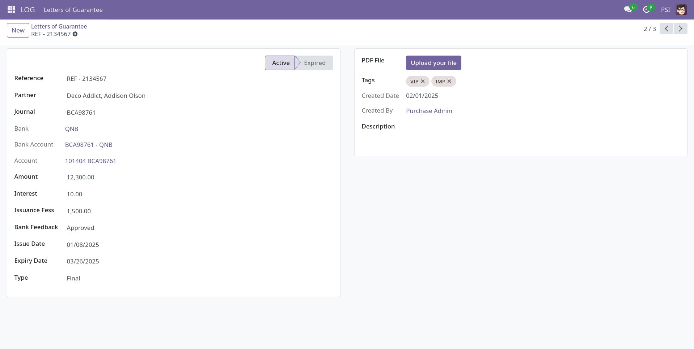
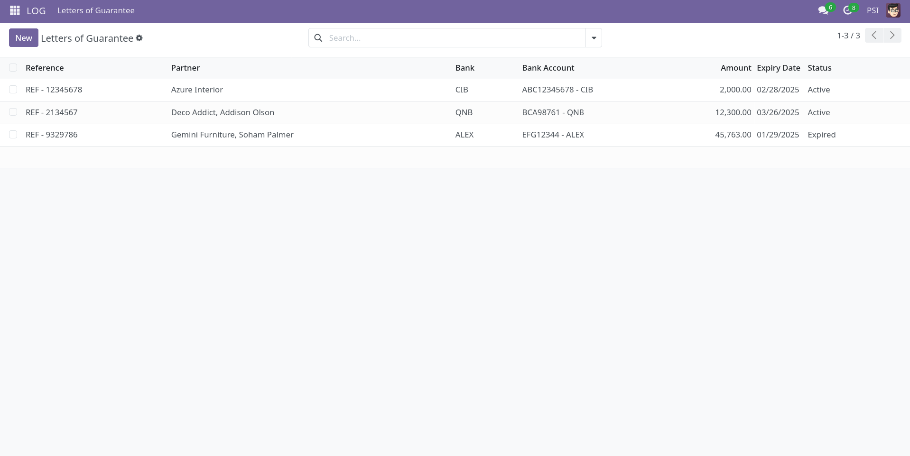
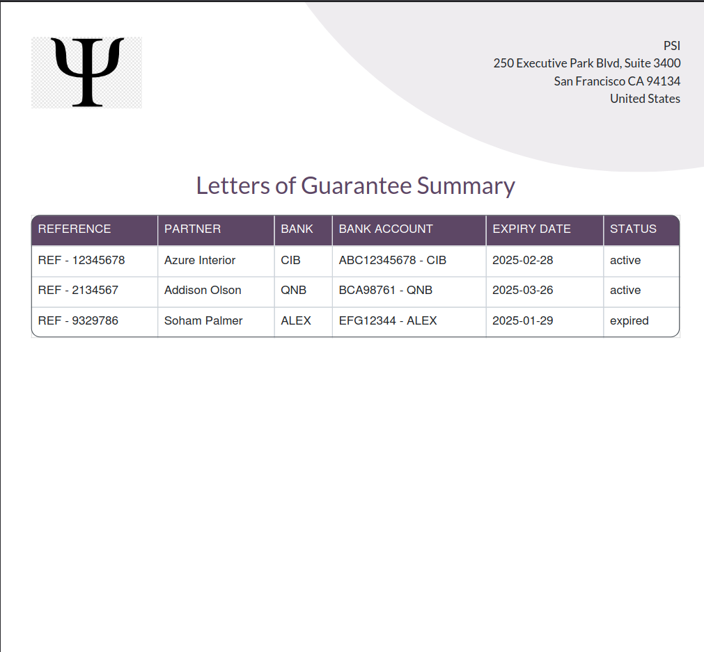
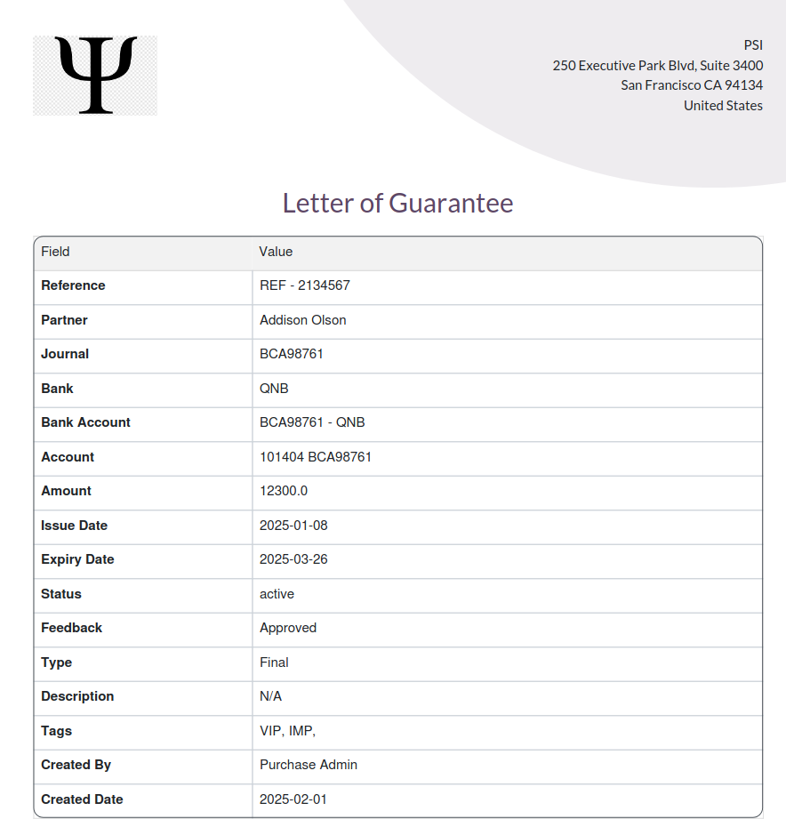

# Psi Letter of Guarantee Odoo Module

## Introduction

Welcome to the Psi Letter of Guarantee Odoo module! 🚀

This module is designed to streamline the management of letters of guarantee in Odoo. It provides features to handle:

- Partner and bank integration.
- Issuance and expiry tracking.
- Fee management and reporting.

### Note:
This module is actively being developed and improved. Contributions, feedback, and suggestions are highly welcome! Remember: RTFM (Read The F*cking Manual) and KISS (Keep It Simple, Stupid!). 😊

## Screenshots

1. Letter of Guarantee Form View

   

2. List View

   

3. Reporting For Many Records 

   

4. Reporting For Doc

   
## Installation

To install the Psi Letter of Guarantee module, follow these steps:

1. **Clone the Repository:**

   Clone the `psi_letter_of_guarantee` directory into your custom addons path:

   ```bash
   git clone https://github.com/mahmoudElshimi/psi_letter_of_guarantee.git /path/to/odoo/custom/addons/
   ```

2. **Restart Odoo and Update App List:**

   ```bash
   sudo systemctl restart odoo
   ```

   Then, go to *Apps* → Click *Update Apps List*.

3. **Install the Module:**

   Find *Psi Letter of Guarantee* in the Apps menu and click *Install*.
   
# *Odoo Apps Store:*

 Alternatively, you can install the module directly from the Odoo Apps Store:
 [Rusetta Assist on Odoo Apps](https://apps.odoo.com/apps/modules/18.0/psi_letter_of_guarantee)


## Links

- [Odoo GitHub Repository](https://github.com/odoo/odoo)
- [Odoo 18.0 Installation from Source](https://www.odoo.com/documentation/18.0/administration/on_premise/source.html)

## How to Contribute

Feel free to fork this repository, raise issues, and create pull requests. All contributions are welcome, following the RTFM and KISS principles! 🚀

